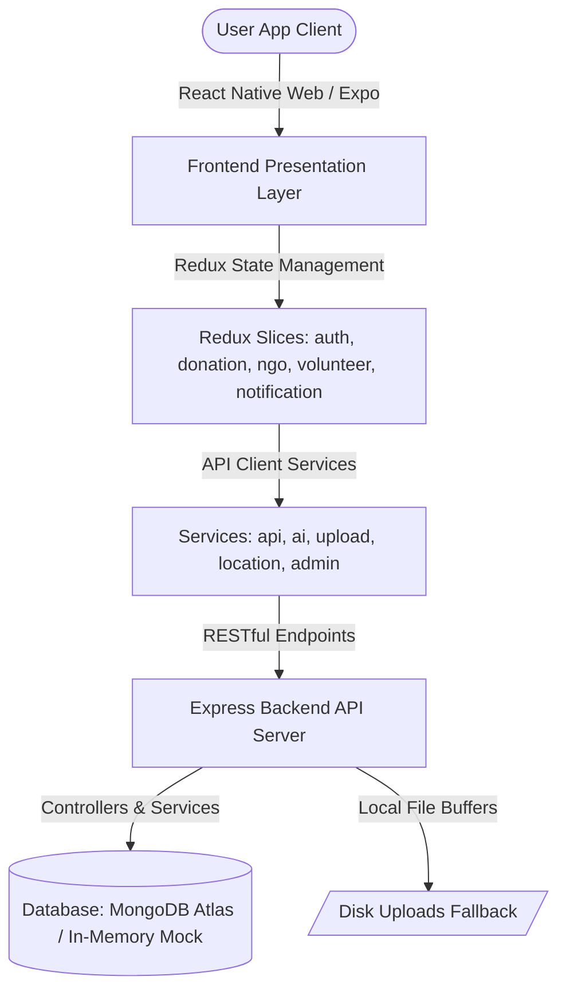

# FoodShare AI Platform 🌍🍲

FoodShare AI is a comprehensive, production-grade web and mobile platform designed to bridge the gap between surplus food donors (restaurants, caterers, grocery stores) and NGOs/beneficiaries. The platform integrates **AI-driven freshness evaluation, smart geographical proximity matching, real-time delivery tracking, and administrative moderation panels**.

---

## 🏗️ Project Architecture Summary

The system is architected as a decoupled, full-stack, TypeScript-enabled application.



### 1. Frontend Client Layer (React Native for Web & Mobile)
* **Framework**: Expo (React Native) targeting both web viewports (responsive desktop browsers) and native mobile layouts (Android/iOS).
* **State Management**: Redux Toolkit for unified global state tracking, action dispatches, and session persistence.
* **Styling & Theme System**: Standardized variables defined in `theme.ts` featuring Outfit font family typography, 16px cards border-radius, and Slate soft shadows. Supports instant light/dark mode toggling.

### 2. Backend API Layer (Node.js & Express)
* **Server**: Express server written in TypeScript with controllers managing business logic per domain.
* **Security & Auth**: JSON Web Token (JWT) request headers signing, bcryptjs credential password hashing, and role-based route middleware whitelists.
* **Static Assets**: Express static mounts configured to serve uploaded donation files.

### 3. Data & Storage Layer (MongoDB & Local Fallback)
* **Primary Database**: Mongoose model schemas configured for MongoDB Atlas clusters.
* **RAM Mock Fallback**: Automatic in-memory mock database seed backup (`mockDb.ts`) that executes if external database connections fail, enabling instant runtime demonstration.
* **Disk Write Fallback**: Saves uploaded base64 data payloads directly to server disks if external cloud media drives are unconfigured.

---

## 🌟 Feature Summary

1. **Authentication (RBAC)**: Supports security checkups for four active system roles: Donor, NGO, Volunteer, and Administrator. Excludes unauthorized cross-role viewports via custom router guards.
2. **Donor Workflow**: Surplus listing creations with AI freshness degradation estimators, photo presets, proximity-based NGO recommendation scorecards, and live pickup tracking.
3. **NGO Workflow**: Real-time listing feed browsing with category filtering, automated accept/reject modals (with custom text entry triggers), and active request timeline panels.
4. **Volunteer Workflow**: Pickup transit claim interfaces, live maps route navigation simulations, and delivery confirmations verified via NGO-scanned QR codes.
5. **Notifications Engine**: Global push notifications banner toasts alongside individual role-specific unread counters driven by Redux notifications state.
6. **Administrative Dashboard**: 5-tab dashboard compiling analytical counters, charts, active user accounts moderators, donation overrides, system-wide reports, and chronological security logs.
7. **Maps & Locations Module**: Great-Circle Haversine distance calculations, operating hub bounds checking, and driving leg segment ETA predictions.
8. **Image Upload Module**: Base64 data header validation checks, 5MB size limits validation, file type whitelisting, and clients-side canvas downsizer compression filters.

---

## ⚙️ Installation & Local Setup

### Prerequisites
* **Node.js**: v18.0.0+ (Local verified: v24.16.0)
* **NPM**: v9.0.0+ (Local verified: v11.13.0)

### 1. Backend Server Setup
```bash
# Navigate to backend folder
cd backend

# Install dependencies
npm install

# Create environment configuration .env
# Configure standard ports, MongoDB cluster URI, and JWT signing key
PORT=5000
MONGODB_URI=mongodb+srv://<user>:<password>@cluster.mongodb.net/foodshare
JWT_SECRET=your-secure-random-secret-key

# Start the dev server (auto-reloads on TypeScript file changes)
npm run dev
```

### 2. Frontend Application Setup
```bash
# Navigate to frontend folder
cd ../frontend

# Install dependencies
npm install

# Configure standard API url targets inside your package files (defaults to http://localhost:5000/api)
# Start the Expo developer compiler
npm run web
```
* Press **`w`** to open the web build instantly inside your default browser.
* Scan the displayed terminal QR code using **Expo Go** to launch the client on physical Android/iOS devices.

---

## 📦 Web Deployment Guide

Deploying the React Native Web interface to standard web servers (Vercel, Netlify, or AWS Amplify):

### 1. Build Compilation
Compile the project assets to high-performance static HTML/JS pages:
```bash
cd frontend
npx expo export:web
```
This command bundles all assets and places them inside the `web-build/` subdirectory.

### 2. Deployment Triggers
* **Vercel / Netlify**: Connect your GitHub repository to the hosting platform. Set the **Build Command** to `npx expo export:web` and the **Publish Directory** to `frontend/web-build`.
* **Static Server**: Copy the contents of the `frontend/web-build/` folder to your static document root (e.g. `/var/www/html` or an AWS S3 static bucket).

---

## 🤖 Android APK Build Guide

We utilize **Expo Application Services (EAS)** cloud pipeline to compile installer APKs without requiring complex local Android Studio/SDK setup.

### 1. Install EAS CLI Tool
Install the compilation command tool globally:
```bash
npm install -g eas-cli
```

### 2. Initialize the EAS Project
Create a free Expo developer account at [expo.dev](https://expo.dev) and log in:
```bash
# Login to EAS
eas login

# Initialize project within the frontend folder
cd frontend
eas project:init
```

### 3. Generate Build Profile Settings
Configure the build pipeline profiles:
```bash
eas build:configure
```
This creates the `eas.json` file. Replace its contents with the following settings to build a standalone APK (rather than a Google Play `.aab` store bundle):
```json
{
  "cli": {
    "version": ">= 9.0.0"
  },
  "build": {
    "development": {
      "developmentClient": true,
      "distribution": "internal"
    },
    "preview": {
      "android": {
        "buildType": "apk"
      }
    },
    "production": {}
  }
}
```

### 4. Trigger the Cloud Build
Start the compilation on Expo's remote servers:
```bash
eas build -p android --profile preview
```
Once complete, the CLI will display a direct QR code and download URL. Scan the QR code or download the generated `.apk` installer file directly to your test Android devices.

---

## 🐙 GitHub Setup Guide

Follow these steps to store your project inside GitHub and establish secure version controls:

### 1. Initialize Version Controls locally
```bash
# From the project root folder (foodshare-ai/)
git init

# Create root-level .gitignore to exclude node modules, secrets, and builds
echo "node_modules/\n.env\ndist/\nweb-build/\n.expo/\n*.log" > .gitignore

# Stage all files
git add .

# Create initial commit
git commit -m "feat: complete foodshare-ai fullstack platform with premium UI styling"
```

### 2. Connect to GitHub
Create a new **private or public** repository on GitHub. Link the remote URL to your local repository and push:
```bash
# Add your GitHub remote repository link
git remote add origin https://github.com/your-username/foodshare-ai.git

# Set main branch
git branch -M main

# Push project files
git push -u origin main
```

### 3. Secure Production Secrets on GitHub
Configure repository environment secrets on GitHub (`Settings` $\rightarrow$ `Secrets and Variables` $\rightarrow$ `Actions` $\rightarrow$ `New repository secret`) to prevent pushing sensitive variables to version controls:
* `MONGODB_URI`: Your production MongoDB cluster string.
* `JWT_SECRET`: A secure signing secret.
* `EXPO_PUBLIC_API_URL`: Your deployed API backend URL.

---

*Documentation compiled by Antigravity IDE Automation Suite.*
